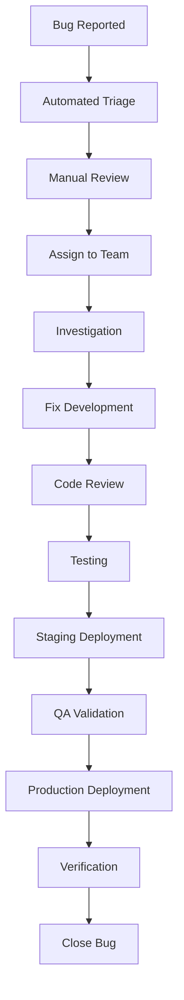

# Bug Tracking and Resolution System

## Overview

This document outlines the comprehensive bug tracking and resolution system for CastChat, including processes, tools, and automation for efficient bug management.

## Bug Classification System

### Severity Levels

#### P0 - Critical (0-2 hours response)
- Complete service outage
- Data corruption or loss
- Security vulnerabilities
- Payment system failures
- Mass user impact (>80% affected)

**Examples:**
- Database completely down
- Authentication system failure
- Data breach
- Site completely inaccessible

#### P1 - High (2-8 hours response)
- Major feature completely broken
- Significant performance degradation
- Authentication issues affecting many users
- Data inconsistency issues

**Examples:**
- Post creation not working
- Login failures for specific user groups
- Search functionality down
- Major UI rendering issues

#### P2 - Medium (1-3 days response)
- Minor feature issues
- UI/UX problems
- Performance issues affecting few users
- Edge case failures

**Examples:**
- Profile image upload issues
- Notification delays
- Mobile responsiveness problems
- Form validation errors

#### P3 - Low (3-7 days response)
- Cosmetic issues
- Minor text/content errors
- Enhancement requests
- Documentation updates

**Examples:**
- Typography inconsistencies
- Color scheme issues
- Tooltip text errors
- Help text updates

### Bug Categories

#### Frontend Bugs
- UI rendering issues
- JavaScript errors
- Responsive design problems
- Browser compatibility issues
- Performance issues

#### Backend Bugs
- API endpoint failures
- Database query errors
- Authentication/authorization issues
- Server performance problems
- Integration failures

#### Infrastructure Bugs
- Deployment issues
- Environment configuration problems
- Monitoring/alerting failures
- Backup/recovery issues
- Security configuration problems

#### Data Bugs
- Data corruption
- Migration failures
- Inconsistent data states
- Query performance issues
- Cache invalidation problems

## Bug Reporting Process

### Automated Bug Detection

#### Client-Side Error Tracking
```typescript
// Error boundary for Vue components
app.config.errorHandler = (err, instance, info) => {
  // Log to error tracking service
  reportError({
    type: 'vue_error',
    error: err.message,
    stack: err.stack,
    component: instance?.$options.name,
    info,
    timestamp: new Date().toISOString(),
    userAgent: navigator.userAgent,
    url: window.location.href
  })
}

// Global error handler
window.addEventListener('error', (event) => {
  reportError({
    type: 'javascript_error',
    error: event.message,
    filename: event.filename,
    line: event.lineno,
    column: event.colno,
    stack: event.error?.stack,
    timestamp: new Date().toISOString()
  })
})

// Unhandled promise rejection handler
window.addEventListener('unhandledrejection', (event) => {
  reportError({
    type: 'promise_rejection',
    error: event.reason,
    timestamp: new Date().toISOString()
  })
})
```

#### Server-Side Error Tracking
```typescript
// Supabase function error handling
export async function handleDatabaseError(error: any, context: string) {
  const errorReport = {
    type: 'database_error',
    error: error.message,
    code: error.code,
    context,
    timestamp: new Date().toISOString(),
    severity: classifyError(error)
  }
  
  // Log to monitoring service
  await logError(errorReport)
  
  // Send alert for critical errors
  if (errorReport.severity === 'critical') {
    await sendAlert(errorReport)
  }
}
```

### Manual Bug Reporting

#### Bug Report Template
```markdown
---
name: Bug Report
about: Report a bug to help us improve
title: '[BUG] Brief description'
labels: bug, needs-triage
assignees: ''
---

## Bug Description
**Summary**: Brief description of the bug

**Expected Behavior**: What should happen

**Actual Behavior**: What actually happens

## Reproduction Steps
1. Go to '...'
2. Click on '...'
3. Enter '...'
4. See error

## Environment
- **Browser**: [e.g., Chrome 120.0.0.0]
- **Device**: [e.g., Desktop, iPhone 15]
- **OS**: [e.g., Windows 11, iOS 17.2]
- **Screen Resolution**: [e.g., 1920x1080]
- **User Type**: [e.g., Guest, Registered User, Admin]

## Additional Information
**Error Messages**: Any error messages or console logs

**Screenshots**: If applicable, add screenshots

**Network**: Any network-related issues

**Data**: Sample data that triggers the issue

## Impact Assessment
- [ ] Blocks critical functionality
- [ ] Affects multiple users
- [ ] Workaround available
- [ ] Intermittent issue
- [ ] Consistent reproduction

## Severity Assessment
- [ ] P0 - Critical (Service down)
- [ ] P1 - High (Major functionality broken)
- [ ] P2 - Medium (Minor functionality affected)
- [ ] P3 - Low (Cosmetic or enhancement)
```

## Bug Triage Process

### Automated Triage
```typescript
interface BugReport {
  id: string
  title: string
  description: string
  severity: 'P0' | 'P1' | 'P2' | 'P3'
  category: string
  reporter: string
  environment: Environment
  reproduction_steps: string[]
  error_logs: string[]
  created_at: string
}

function automaticTriage(bug: BugReport): TriageResult {
  const keywords = {
    critical: ['down', 'crash', 'data loss', 'security', 'payment'],
    high: ['login', 'cannot', 'broken', 'error 500'],
    ui: ['display', 'layout', 'responsive', 'mobile'],
    performance: ['slow', 'timeout', 'lag', 'performance']
  }
  
  let suggestedSeverity = bug.severity
  let suggestedCategory = bug.category
  let assignedTeam = 'triage'
  
  // Auto-classify based on keywords
  const description = bug.description.toLowerCase()
  
  if (keywords.critical.some(word => description.includes(word))) {
    suggestedSeverity = 'P0'
    assignedTeam = 'infrastructure'
  } else if (keywords.high.some(word => description.includes(word))) {
    suggestedSeverity = 'P1'
  }
  
  if (keywords.ui.some(word => description.includes(word))) {
    suggestedCategory = 'frontend'
    assignedTeam = 'frontend'
  } else if (keywords.performance.some(word => description.includes(word))) {
    suggestedCategory = 'performance'
    assignedTeam = 'infrastructure'
  }
  
  return {
    suggestedSeverity,
    suggestedCategory,
    assignedTeam,
    confidence: calculateConfidence(bug, keywords)
  }
}
```

### Manual Triage Workflow
1. **Initial Assessment** (< 1 hour)
   - Verify bug reproducibility
   - Classify severity and category
   - Assign to appropriate team
   - Add labels and milestones

2. **Technical Investigation** (< 4 hours for P0/P1)
   - Root cause analysis
   - Impact assessment
   - Effort estimation
   - Priority assignment

3. **Resolution Planning**
   - Create technical solution plan
   - Assign developer
   - Set timeline
   - Identify dependencies

## Bug Resolution Workflow

### Development Process


### Branch Strategy for Bug Fixes
```bash
# Critical hotfixes (P0)
git checkout main
git checkout -b hotfix/P0-critical-auth-failure
# Fix, test, deploy immediately

# High priority bugs (P1)
git checkout develop
git checkout -b bugfix/P1-post-creation-error
# Fix, test, merge to develop, then main

# Regular bugs (P2/P3)
git checkout develop
git checkout -b bugfix/P2-profile-image-upload
# Fix, test, merge to develop
```

## Quality Assurance

### Automated Testing for Bug Prevention
```typescript
// Integration tests for critical flows
describe('Critical User Flows', () => {
  test('User can complete registration and login', async () => {
    // Test complete auth flow
  })
  
  test('User can create and view posts', async () => {
    // Test post creation flow
  })
  
  test('Application submission works correctly', async () => {
    // Test application flow
  })
})

// Regression test suite
describe('Regression Tests', () => {
  test('Bug #123: Profile image upload', async () => {
    // Specific test for resolved bug
  })
  
  test('Bug #456: Search filtering', async () => {
    // Specific test for resolved bug
  })
})
```

### Bug Fix Validation
1. **Unit Tests**: Ensure fix doesn't break existing functionality
2. **Integration Tests**: Test the complete flow
3. **Manual Testing**: Verify fix in real scenarios
4. **Regression Testing**: Ensure bug doesn't reappear
5. **Performance Testing**: Verify fix doesn't impact performance

## Monitoring and Alerting

### Error Rate Monitoring
```typescript
// Monitor error rates and alert on spikes
const errorRateThresholds = {
  P0: 0.1, // 0.1% error rate triggers P0 alert
  P1: 1.0, // 1.0% error rate triggers P1 alert
  P2: 5.0  // 5.0% error rate triggers P2 alert
}

async function monitorErrorRates() {
  const currentErrorRate = await getCurrentErrorRate()
  
  if (currentErrorRate > errorRateThresholds.P0) {
    await createAutomaticBug({
      severity: 'P0',
      title: 'Critical: High error rate detected',
      description: `Error rate spiked to ${currentErrorRate}%`,
      category: 'infrastructure'
    })
  }
}
```

### Proactive Bug Detection
```typescript
// Health check failures trigger automatic bug reports
healthMonitor.subscribe(async (health) => {
  if (health.status === 'unhealthy') {
    await createAutomaticBug({
      severity: 'P1',
      title: `Service unhealthy: ${Object.keys(health.services).join(', ')}`,
      description: JSON.stringify(health, null, 2),
      category: 'infrastructure'
    })
  }
})
```

## Bug Metrics and Reporting

### Key Metrics
- **Bug Discovery Rate**: Bugs found per week
- **Bug Resolution Time**: Time from report to fix
- **Bug Reopen Rate**: Percentage of bugs that reopen
- **Escape Rate**: Bugs found in production vs staging
- **Team Performance**: Resolution time by team
- **User Impact**: Users affected by bugs

### Automated Reporting
```typescript
// Weekly bug report generation
async function generateWeeklyBugReport() {
  const report = {
    period: getLastWeek(),
    metrics: {
      totalBugs: await getBugCount('last_week'),
      resolvedBugs: await getResolvedBugCount('last_week'),
      criticalBugs: await getCriticalBugCount('last_week'),
      averageResolutionTime: await getAverageResolutionTime('last_week'),
      topCategories: await getTopBugCategories('last_week')
    },
    trends: await getBugTrends(),
    recommendations: await generateRecommendations()
  }
  
  // Send to team channels
  await sendBugReport(report)
}
```

## Communication and Escalation

### Notification Rules
- **P0 Bugs**: Immediate Slack/Discord alert + SMS
- **P1 Bugs**: Slack/Discord alert within 15 minutes
- **P2 Bugs**: Daily summary in team channel
- **P3 Bugs**: Weekly summary

### Escalation Matrix
```typescript
const escalationRules = {
  P0: {
    immediate: ['infra-lead', 'tech-lead'],
    after_30min: ['cto', 'engineering-manager'],
    after_2hours: ['entire-team']
  },
  P1: {
    immediate: ['team-lead'],
    after_4hours: ['infra-lead', 'tech-lead'],
    after_24hours: ['engineering-manager']
  }
}
```

## Bug Prevention Strategies

### Code Quality Gates
1. **Mandatory Code Reviews**: All code must be reviewed
2. **Automated Testing**: 80%+ test coverage required
3. **Static Analysis**: ESLint, TypeScript strict mode
4. **Security Scanning**: Automated vulnerability checks

### Process Improvements
1. **Retrospectives**: Weekly bug analysis in team meetings
2. **Root Cause Analysis**: For all P0/P1 bugs
3. **Documentation Updates**: Update docs based on bugs
4. **Training**: Team training on common bug patterns

## Tools and Integration

### Bug Tracking Tools
- **Primary**: GitHub Issues with automation
- **Labels**: Automated labeling based on classification
- **Milestones**: Release-based milestone tracking
- **Projects**: Kanban board for bug workflow

### Integration with Development Tools
```yaml
# GitHub Actions workflow for bug handling
name: Bug Triage
on:
  issues:
    types: [opened, labeled]

jobs:
  auto-triage:
    runs-on: ubuntu-latest
    steps:
      - name: Auto-assign based on labels
        uses: ./.github/actions/auto-assign
      - name: Set priority based on severity
        uses: ./.github/actions/set-priority
      - name: Notify relevant team
        uses: ./.github/actions/notify-team
```

This comprehensive bug tracking system ensures systematic identification, classification, and resolution of bugs while maintaining high code quality and user satisfaction.