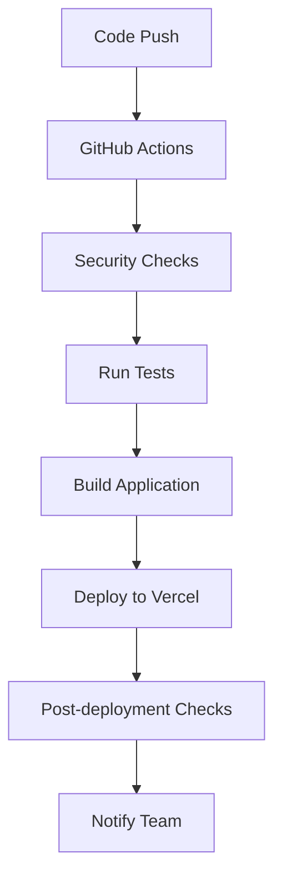

# Deployment Guide

## Overview

This document outlines the deployment process for the CastChat application, including environment setup, deployment procedures, and troubleshooting.

## Deployment Environments

### 1. Development (Local)
- **URL**: http://localhost:5173
- **Database**: Local Supabase or development instance
- **Purpose**: Local development and testing

### 2. Staging
- **URL**: https://staging.castchat.jp
- **Database**: Staging Supabase project
- **Purpose**: Testing and quality assurance
- **Trigger**: Push to `develop` branch

### 3. Production
- **URL**: https://castchat.jp
- **Database**: Production Supabase project
- **Purpose**: Live application
- **Trigger**: Push to `main` branch

## Prerequisites

### Required Tools
- Node.js v20.x or later
- npm v10.x or later
- Git 2.x or later
- Vercel CLI (optional for manual deployments)
- Supabase CLI (optional for database operations)

### Required Accounts
- GitHub account with repository access
- Vercel account linked to GitHub
- Supabase account with project access

### Environment Variables

#### Production Environment Variables (Vercel)
Set these in the Vercel dashboard:

```
VITE_APP_URL=https://castchat.jp
VITE_APP_NAME=VRChat Cast Recruitment Board
VITE_SUPABASE_URL=https://ewjfnquypoeyoicmgbnp.supabase.co
VITE_SUPABASE_ANON_KEY=eyJhbGciOiJIUzI1NiIsInR5cCI6IkpXVCJ9...
GOOGLE_CLIENT_ID=YOUR_GOOGLE_CLIENT_ID
GOOGLE_CLIENT_SECRET=YOUR_GOOGLE_CLIENT_SECRET
```

#### GitHub Secrets
Set these in GitHub repository settings:

```
VERCEL_TOKEN=xxx
VERCEL_ORG_ID=xxx
VERCEL_PROJECT_ID=xxx
SLACK_WEBHOOK_URL=xxx (optional)
```

## Deployment Methods

### 1. Automatic Deployment (Recommended)

#### Staging Deployment
1. Create feature branch from `develop`
2. Make changes and commit
3. Push to remote feature branch
4. Create Pull Request to `develop`
5. Merge PR → Automatic staging deployment

#### Production Deployment
1. Create Pull Request from `develop` to `main`
2. Review and approve PR
3. Merge to `main` → Automatic production deployment

### 2. Manual Deployment

#### Using npm scripts:
```bash
# Deploy to staging
npm run deploy:staging

# Deploy to production (from main branch only)
npm run deploy:production

# Run pre-deployment checks
npm run pre-deploy
```

#### Using Vercel CLI:
```bash
# Install Vercel CLI
npm install -g vercel

# Link project (first time only)
vercel link

# Deploy to staging
vercel

# Deploy to production
vercel --prod
```

## Deployment Process

### Pre-Deployment Checklist
- [ ] All tests passing
- [ ] Security checks passed
- [ ] No console errors
- [ ] Environment variables configured
- [ ] Database migrations ready (if any)
- [ ] Documentation updated

### Deployment Steps

1. **Pre-deployment checks**
   - Security audit
   - Dependency vulnerabilities check
   - Code quality checks
   - Test execution

2. **Build process**
   - Install dependencies
   - TypeScript compilation
   - Asset optimization
   - Bundle generation

3. **Database operations**
   - Run pending migrations
   - Update database schema
   - Verify data integrity

4. **Application deployment**
   - Deploy to Vercel
   - Configure environment variables
   - Update routing rules

5. **Post-deployment verification**
   - Health check
   - Security headers verification
   - Functionality testing

### Automated Deployment Pipeline



## Database Migrations

### Running Migrations
```bash
# Check pending migrations
supabase db diff

# Apply migrations
supabase db push

# Reset database (development only)
supabase db reset
```

### Migration Best Practices
- Always test migrations on staging first
- Create backup before production migrations
- Use reversible migrations when possible
- Document schema changes

## Monitoring and Alerts

### Health Checks
- Application uptime monitoring
- Database connection monitoring
- API response time monitoring
- Error rate monitoring

### Performance Monitoring
- Core Web Vitals tracking
- Page load time monitoring
- Bundle size monitoring
- CDN performance monitoring

### Error Tracking
- Application error logging
- Build failure notifications
- Deployment failure alerts
- Security incident alerts

## Rollback Procedures

### Automatic Rollback
GitHub Actions will automatically rollback if:
- Post-deployment health checks fail
- Security checks fail
- Critical errors detected

### Manual Rollback

#### Using Vercel:
```bash
# List deployments
vercel ls

# Promote previous deployment
vercel promote [deployment-url] --prod
```

#### Using Git:
```bash
# Revert last commit
git revert HEAD

# Push revert
git push origin main
```

## Troubleshooting

### Common Issues

#### Deployment Fails
1. Check GitHub Actions logs
2. Verify environment variables
3. Check build logs in Vercel
4. Verify dependencies

#### Site Not Loading
1. Check DNS configuration
2. Verify SSL certificate
3. Check Vercel deployment status
4. Review application logs

#### Database Connection Issues
1. Verify Supabase credentials
2. Check database status
3. Review connection limits
4. Check network connectivity

#### Authentication Not Working
1. Verify Google OAuth configuration
2. Check redirect URLs
3. Review Supabase Auth settings
4. Validate environment variables

### Debug Commands

```bash
# Check deployment status
vercel ls

# View deployment logs
vercel logs [deployment-url]

# Test local build
npm run build && npm run preview

# Check environment variables
vercel env ls

# Validate configuration
npm run security-check
```

## Performance Optimization

### Build Optimization
- Bundle size analysis
- Code splitting
- Tree shaking
- Asset compression

### Runtime Optimization
- CDN configuration
- Caching strategies
- Image optimization
- Lazy loading

### Database Optimization
- Query optimization
- Index creation
- Connection pooling
- Caching strategies

## Security Considerations

### Deployment Security
- Secure environment variable storage
- Access control for deployment
- Audit trail for deployments
- Rollback capabilities

### Runtime Security
- Security headers configuration
- CORS policy enforcement
- Input validation
- Rate limiting

## Backup and Recovery

### Database Backups
- Daily automated backups (Supabase)
- Point-in-time recovery capability
- Backup retention policy
- Recovery testing

### Application Backups
- Git repository backup
- Environment configuration backup
- Deployment history
- Documentation backup

## Team Responsibilities

### Infrastructure Team
- Deployment pipeline maintenance
- Environment configuration
- Security monitoring
- Performance optimization

### Development Team
- Code quality assurance
- Test coverage maintenance
- Documentation updates
- Feature deployment coordination

### QA Team
- Staging environment testing
- Production verification
- Bug reporting and tracking
- User acceptance testing

## Contact Information

### Emergency Contacts
- **Infrastructure Team**: infra@castchat.jp
- **Development Lead**: dev-lead@castchat.jp
- **Emergency Hotline**: +81-XX-XXXX-XXXX

### Communication Channels
- **Incidents**: #incidents (Discord/Slack)
- **Deployments**: #deployments (Discord/Slack)
- **General**: #development (Discord/Slack)

## Change Log

### Version 1.0.0
- Initial deployment pipeline setup
- Automated staging and production deployments
- Security checks integration
- Monitoring and alerting setup